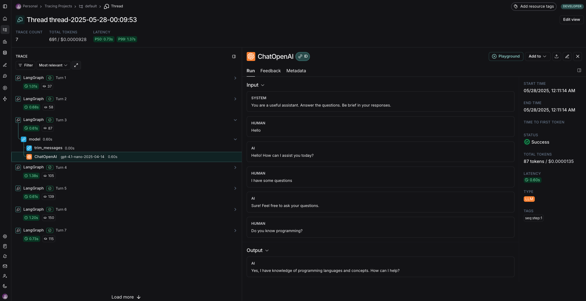

# GPT-ChatBot

GPT-ChatBot is a lightweight, Streamlit-based web app that allows users to interact with OpenAI’s GPT models through a conversational UI. It leverages **LangChain** for structured prompt handling, **LangGraph** for message state management with memory, and **LangSmith** for LLM trace logging.  
The chatbot trims messages to reduce token usage (and cost), and logs each interaction with a dynamically generated thread ID for session traceability.

---

## Project Structure
```text
GPT-ChatBot
├─ README.md
├─ .gitignore
└─ gpt_chatbot
   ├─ chatbot_app.py  # Streamlit frontend UI and session management
   ├─ chatbot_backend.py  # Core chatbot class with LangChain, LangGraph, memory, trimmer
   ├─ config_example.json  # Template config file to be copied and filled with API keys and model
   ├─ media
   │  ├─ AI_ChatBot.mp4  # Demo video of the chatbot in action
   │  └─ ChatBot_Tracing.png  # Example LangSmith trace log
   ├─ requirements.txt  # Python dependencies
   └─ utils.py  # Helper functions for config loading, datetime handling, etc.
```

---

## Installation
I a virtual environment, e.g. `conda`, with Python 3.13 the project dependencies can be installed as follows:
```bash
cd GPT-ChatBot
pip install -r gpt_chatbot/requirements.txt
```

---

## Running the Chatbot App

### Config Setup
Before runnig the chatbot the configuration file needs to be set up with your OpenAI and LangSmith API keys, as well as the model that will be used.  
The provided template config file `gpt_chatbot/config_example.json` should be copied to `gpt_chatbot/config.json` and edited with the API keys and model name.

```json
{
  "OPENAI_API_KEY": "the-openai-api-key",
  "LANGCHAIN_TRACING_V2": "true",
  "LANGCHAIN_API_KEY": "the-langsmith-api-key",
  "LANGCHAIN_PROJECT": "the-langsmith-project-name",
  "MODEL_NAME": "gpt-4.1-nano-2025-04-14"
}
```

Regarding the configuration options:
- `OPENAI_API_KEY`: The OpenAI API key can be generated from the OpenAI API platform.
- `LANGCHAIN_TRACING_V2`: Set to `true` to enable LangSmith tracing. If set to `false`, LangSmith tracing will be disabled.
- `LANGCHAIN_API_KEY`: The LangSmith API key can be generated from the LangSmith platform. If LangSmith tracing is disabled, this key can be omitted.
- `LANGCHAIN_PROJECT`: The name of the LangSmith project where traces will be logged. If LangSmith tracing is disabled, this can be omitted.
- `MODEL_NAME`: The OpenAI model to be used for the chatbot. If preferred, another model can be used, e.g. `gpt-4.1-2025-04-14`.

### Running the App
The Streamlit server can be started by running the following command in the terminal from the `gpt_chatbot` directory:
```bash
streamlit run chatbot_app.py
```
A browser window should open automatically. If it does not, the app can be accessed by navigating to the following URL in a web browser:
```
http://localhost:8501
```

#### How It Works
- Uses OpenAI GPT models for conversational AI
- `LangChain` is used for structured prompt handling
- `LangGraph` is used to manage conversation state and memory
- A trimmer is used to limit message length, optimizing for cost and performance
- `LangSmith` is used for LLM trace logging, enabling session tracking and debugging. Each session is logged with a unique dynamic thread ID for trace filtering.

---

## Streamlit Demo

Below is a short video demonstrating the chatbot in action within the Streamlit UI. Prompts can be entered, and the LLM will respond in real time, maintaining chat memory and formatting. The chatbot is designed to be user-friendly and efficient, providing concise responses while managing token usage effectively.

<video width="600" controls>
  <source src="gpt_chatbot/media/AI_ChatBot.mp4" type="video/mp4">
  Browser does not support the video tag.
</video>

---

## LangSmith Logs Example

Below is an example of a LangSmith trace log for a single LLM response. The trace includes the full conversation history, memory messages, trimmed prompt inputs, token usage, and model call duration.


